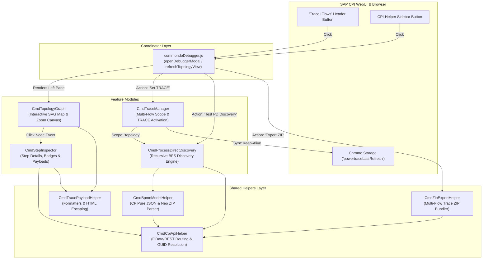

# Commondo IS Debugger - Plugin Architecture & SAP CPI API Endpoints

This document provides a comprehensive technical reference for the **Commondo IS Debugger** plugin, including its modular namespace architecture, feature orchestration schema, directory structure, and all REST / OData endpoints utilized across both **SAP Neo** and **SAP BTP Cloud Foundry (SAP Integration Suite)** environments.

---

## 🏗️ 1. Modular Namespace Architecture

The plugin is structured into distinct, modular layers. Each module is declared under a dedicated `Cmd...` namespace object and exported to `window` for transparent cross-module communication:

```text
plugins/commondoDebugger/
├── README.md                                 # Technical documentation & API references
├── commondoDebugger.js                       # Main coordinator, plugin registration & modal UI
├── helpers/                                  # Reusable core utilities & API layers
│   ├── cpiApiHelper.js                       # Namespace: CmdCpiApiHelper
│   ├── bpmnModelHelper.js                    # Namespace: CmdBpmnModelHelper
│   ├── tracePayloadHelper.js                 # Namespace: CmdTracePayloadHelper
│   └── zipExportHelper.js                    # Namespace: CmdZipExportHelper
└── features/                                 # Business capability modules
    ├── processDirectDiscovery.js             # Namespace: CmdProcessDirectDiscovery
    ├── traceManager.js                       # Namespace: CmdTraceManager
    ├── topologyGraph.js                      # Namespace: CmdTopologyGraph
    └── stepInspector.js                      # Namespace: CmdStepInspector
```

### Module Namespace Mapping

| File | Namespace Object | Window Export | Primary Responsibilities |
| :--- | :--- | :--- | :--- |
| `helpers/cpiApiHelper.js` | `const CmdCpiApiHelper` | `window.CmdCpiApiHelper`<br>`window.getApiUrl`<br>`window.parseMs` | Universal API URL routing (CF vs Neo), platform detection, package GUID and deployed artifact caching. |
| `helpers/bpmnModelHelper.js` | `const CmdBpmnModelHelper` | `window.CmdBpmnModelHelper` | Web Modeler Pure JSON diagram parsing (CF), in-memory ZIP extraction (Neo), `parameters.prop` placeholder resolution. |
| `helpers/tracePayloadHelper.js` | `const CmdTracePayloadHelper` | `window.CmdTracePayloadHelper` | HTML escaping, timestamp parsing, execution duration formatters. |
| `helpers/zipExportHelper.js` | `const CmdZipExportHelper` | `window.CmdZipExportHelper` | Full multi-tier trace bundle builder, steps extractor, and ZIP archive download generator. |
| `features/processDirectDiscovery.js` | `const CmdProcessDirectDiscovery` | `window.CmdProcessDirectDiscovery` | Multi-tier BFS dependency queue traversal engine, dynamic endpoint matching (`/${property.reportId}`), ASCII tree tester. |
| `features/traceManager.js` | `const CmdTraceManager` | `window.CmdTraceManager` | Bulk TRACE log level activator (`topology`, `package`, `current`, `all`) and CPI-Helper Red Button storage synchronizer. |
| `features/topologyGraph.js` | `const CmdTopologyGraph` | `window.CmdTopologyGraph` | Strict interval containment call tree builder, SVG Multi-Column Map renderer, pan/zoom canvas controls. |
| `features/stepInspector.js` | `const CmdStepInspector` | `window.CmdStepInspector` | Execution step list (#106 To Fiori Structure), activity badges, properties/headers/body payload fetcher. |
| `commondoDebugger.js` | Main Coordinator | `pluginList.push(plugin)` | Plugin lifecycle, UI modal assembly, header button injector, event dispatcher. |

---

## 📊 2. Feature Orchestration & Usage Schema

### A. Architectural Interaction Flow




---

### B. When to Call Features in `commondoDebugger.js`

| Scenario | Does it need `commondoDebugger.js`? | How It Works |
| :--- | :--- | :--- |
| **New Toolbar / Header Button in Modal** | **YES** | `commondoDebugger.js` renders the modal HTML and binds `onclick` to your feature namespace (e.g. `CmdMyFeature.action()`). |
| **New Main View / Split Pane** | **YES** | `commondoDebugger.js` creates the DOM container in `openDebuggerModal()` and passes it to `CmdMyFeature.render(container)`. |
| **Feature-to-Feature Calling** | **NO** | Features call each other directly via their namespaces (e.g. `CmdTraceManager` calls `CmdProcessDirectDiscovery.discoverProcessDirectTopology()` directly). |
| **Background Utility / Shortcut** | **NO** | Feature self-registers its own keyboard shortcut or event listener directly upon script injection. |

---

## 🌐 3. SAP CPI Endpoint Reference (Neo vs Cloud Foundry)

### A. Environment Identification & Routing

| Concept | SAP Neo | SAP BTP Cloud Foundry / Integration Suite |
| :--- | :--- | :--- |
| **Host Pattern** | `https://<tenant>-tmn.hci.<region>.hana.ondemand.com` | `https://<tenant>.integrationsuite.cfapps.<region>.hana.ondemand.com` |
| **Platform Check** | `CmdCpiApiHelper.isNeo() === true` | `CmdCpiApiHelper.isCloudFoundry() === true` |
| **Base WebUI Path** | `/itspaces/` | `/` or `/shell/` |
| **OData Runtime Base** | `/itspaces/odata/api/v1/` | `/api/v1/` or `/odata/api/v1/` |
| **Workspace Base** | `/itspaces/odata/1.0/workspace.svc/` | `/api/1.0/workspace/` |

---

### B. Artifact & Package Discovery Endpoints

#### 1. List Package Artifacts
* **SAP Neo (OData v1.0 Workspace):**
  ```http
  GET /itspaces/odata/1.0/workspace.svc/ContentPackages('{packageId}')/Artifacts?$format=json
  ```
* **SAP Cloud Foundry (REST Workspace API):**
  ```http
  GET /api/1.0/workspace/{workspaceGuid}/artifacts
  ```
* **Fallback (OData v1):**
  ```http
  GET /api/v1/IntegrationPackages('{packageId}')/IntegrationDesigntimeArtifacts?$format=json
  ```

#### 2. Workspace GUID Resolution (Cloud Foundry)
* **REST API:**
  ```http
  GET /api/1.0/workspace
  ```
  *Returns an array of all workspace packages mapping technical names to Hex GUIDs (`id`).*

#### 3. List All Deployed Tenant Artifacts
* **Primary (WebUI Operations Command):**
  ```http
  GET /itspaces/Operations/com.sap.it.op.tmn.commands.dashboard.webui.IntegrationComponentsListCommand
  ```
* **Fallback (OData Runtime):**
  ```http
  GET /api/v1/IntegrationRuntimeArtifacts?$format=json&$select=Id,Name
  ```

---

### C. BPMN Model & ProcessDirect Parsing Endpoints

#### 1. Cloud Foundry: Pure JSON Web Modeler Diagram API ⭐️
> Directly retrieves the full BPMN shape tree and `ProcessDirect` channel configurations without downloading or unzipping any files:
```http
GET /api/1.0/workspace/{packageGuid}/artifacts/{artifactGuid}/entities/{artifactGuid}/iflows/{iflowId}?$format=json
```

#### 2. SAP Neo: Direct OData Binary Artifact Endpoint
> Retrieves the active integration flow bundle (`.iflw`, `parameters.prop`), decompressed in-memory via `JSZip` in ~2ms:
```http
GET /itspaces/odata/api/v1/IntegrationDesigntimeArtifacts(Id='{iflowId}',Version='active')/$value
```

---

### D. Trace & Message Processing Endpoints

#### 1. Query Recent Message Processing Logs
```http
GET /api/v1/MessageProcessingLogs?$top=20&$orderby=LogStart desc&$format=json&$filter=IntegrationArtifact/Id eq '{iflowId}'
```

#### 2. Query Full Correlation Call-Chain
```http
GET /api/v1/MessageProcessingLogs?$format=json&$filter=CorrelationId eq '{correlationId}'&$orderby=LogStart
```

#### 3. Fetch Step Runs for a Message Log
```http
GET /api/v1/MessageProcessingLogs('{messageGuid}')/Runs?$format=json
```

#### 4. Fetch Individual Run Steps
```http
GET /api/v1/MessageProcessingLogRuns('{runId}')/RunSteps?$format=json&$top=300
```

#### 5. Fetch Trace Step Messages
```http
GET /api/v1/MessageProcessingLogRunSteps(RunId='{runId}',ChildCount={childCount})/TraceMessages?$format=json
```

#### 6. Fetch Step Payload Data (Properties, Headers, Body)
* **Exchange Properties:**
  ```http
  GET /api/v1/TraceMessages({traceId})/ExchangeProperties?$format=json
  ```
* **Headers:**
  ```http
  GET /api/v1/TraceMessages({traceId})/Properties?$format=json
  ```
* **Payload Body ($value):**
  ```http
  GET /api/v1/TraceMessages({traceId})/$value
  ```

#### 7. Set Log Level (Activate TRACE)
* **Primary (WebUI Operations Command):**
  ```http
  POST /Operations/com.sap.it.op.tmn.commands.dashboard.webui.IntegrationComponentSetMplLogLevelCommand
  Content-Type: application/json;charset=UTF-8

  {
    "artifactSymbolicName": "{iflowId}",
    "mplLogLevel": "TRACE",
    "nodeType": "IFLMAP"
  }
  ```
* **Fallback (OData Runtime PUT):**
  ```http
  PUT /api/v1/IntegrationRuntimeArtifacts('{iflowId}')
  Content-Type: application/json

  {
    "LogLevel": "TRACE"
  }
  ```

---

## 🧩 4. Adding or Extending Features (Namespace Pattern)

Features follow a clean namespace declaration pattern:

```javascript
// plugins/commondoDebugger/features/myCustomFeature.js

const CmdMyCustomFeature = {
  /**
   * Perform custom debugging or inspection action.
   */
  async executeFeature() {
    // 1. Access core helpers via their global namespaces:
    const apiHelper = typeof CmdCpiApiHelper !== "undefined" ? CmdCpiApiHelper : {};
    const bpmnHelper = typeof CmdBpmnModelHelper !== "undefined" ? CmdBpmnModelHelper : {};
    const traceHelper = typeof CmdTracePayloadHelper !== "undefined" ? CmdTracePayloadHelper : {};

    // 2. Perform feature logic
    const deployed = await apiHelper.fetchDeployedArtifacts();
    console.log("Deployed flows:", deployed);
  },
};

// Expose to window namespace
if (typeof window !== "undefined") {
  window.CmdMyCustomFeature = CmdMyCustomFeature;
}
```

### Loading Order in `manifest.json`:
1. `helpers/cpiApiHelper.js`
2. `helpers/bpmnModelHelper.js`
3. `helpers/tracePayloadHelper.js`
4. `helpers/zipExportHelper.js`
5. `features/processDirectDiscovery.js`
6. `features/traceManager.js`
7. `features/topologyGraph.js`
8. `features/stepInspector.js`
9. `commondoDebugger.js`
